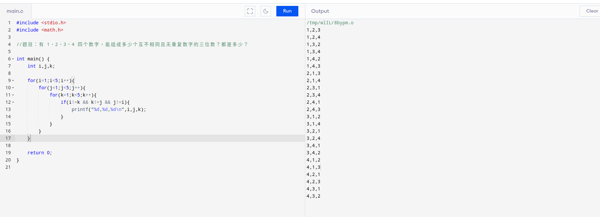

# c_100_test-
https://www.runoob.com/cprogramming/c-exercise-example1.html 


<br>

# Q1 

## 题目：有 1、2、3、4 四个数字，能组成多少个互不相同且无重复数字的三位数？都是多少？

```
#include <stdio.h>
#include <math.h>

//题目：有 1、2、3、4 四个数字，能组成多少个互不相同且无重复数字的三位数？都是多少？

int main() {
    int i,j,k;
    
    for(i=1;i<5;i++){
        for(j=1;j<5;j++){
            for(k=1;k<5;k++){
                if(i!=k && k!=j && j!=i){
                    printf("%d,%d,%d\n",i,j,k);
                }
            }
        }
    }

    return 0;
}
```



<br>

# Q2

## 题目：企业发放的奖金根据利润提成。

    利润(I)低于或等于10万元时，奖金可提10%；
    利润高于10万元，低于20万元时，低于10万元的部分按10%提成，高于10万元的部分，可提成7.5%；
    20万到40万之间时，高于20万元的部分，可提成5%；
    40万到60万之间时高于40万元的部分，可提成3%；
    60万到100万之间时，高于60万元的部分，可提成1.5%；
    高于100万元时，超过100万元的部分按1%提成。

```

#include<stdio.h>
int main()
{
    double i;
    double bonus1,bonus2,bonus4,bonus6,bonus10,bonus;
    printf("你的净利润是：\n");
    scanf("%lf",&i);
    bonus1=100000*0.1;
    bonus2=bonus1+100000*0.075;
    bonus4=bonus2+200000*0.05;
    bonus6=bonus4+200000*0.03;
    bonus10=bonus6+400000*0.015;
    if(i<=100000) {
        bonus=i*0.1;
    } else if(i<=200000) {
        bonus=bonus1+(i-100000)*0.075;
    } else if(i<=400000) {
        bonus=bonus2+(i-200000)*0.05;
    } else if(i<=600000) {
        bonus=bonus4+(i-400000)*0.03;
    } else if(i<=1000000) {
        bonus=bonus6+(i-600000)*0.015;
    } else if(i>1000000) {
        bonus=bonus10+(i-1000000)*0.01;
    }
    printf("提成为：bonus=%lf",bonus);
 
    printf("\n");
}
```
